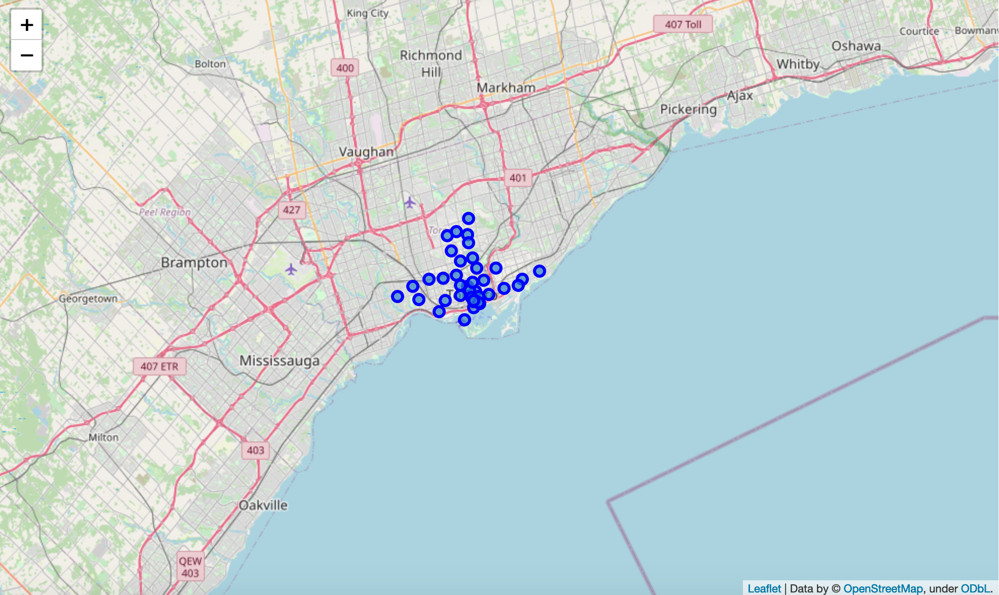
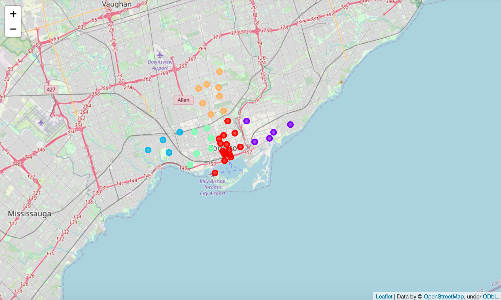

# Coursera_Capstone

## Segmenting and Clustering Toronto Neighborhoods

Visualization of the neighborhoods in boroughs that have the word Toronto.

Visualization of the neighborhood clusters generated using the KMeans ML algorithm.

